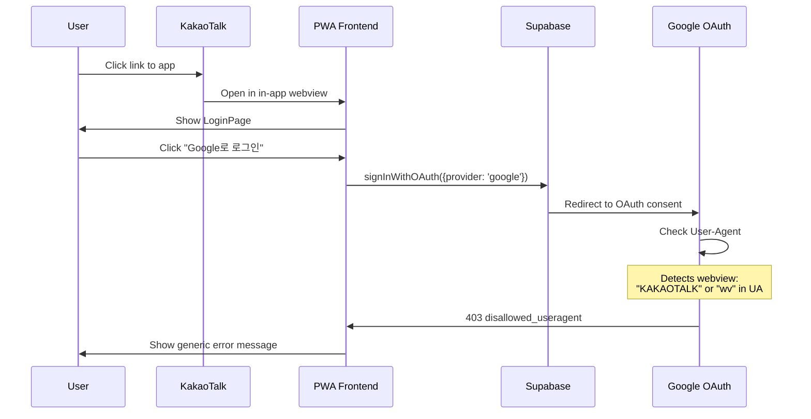

# Research: Google OAuth Login Failure in KakaoTalk In-App WebView on Samsung Galaxy Android

**Date**: 2025-10-15T15:30:00+09:00
**Researcher**: GitHub Copilot
**Git Commit**: debug-deployment
**Branch**: debug-deployment
**Repository**: simulation

## Research Question

Why does Google OAuth login fail with "403 error: disallowed_useragent" when accessed through KakaoTalk in-app webview on Samsung Galaxy Android devices, while it works correctly on iPhone devices?

## Summary

The issue is caused by **Google's OAuth security policy that blocks authentication from embedded/in-app browsers** (webviews). When users access the application through KakaoTalk's in-app webview on Android, Google detects the restricted user-agent and blocks the OAuth flow with a 403 error. The current implementation uses Supabase's `signInWithOAuth()` method without the `skipBrowserRedirect` option, which relies on browser redirects that are incompatible with embedded webviews. iOS works because Apple's policies and implementation handle webviews differently, and Google may have less restrictive policies for iOS webviews.

**Root Cause**: The application lacks proper detection and handling of embedded browser environments. The current OAuth implementation does not:

1. Detect when running in an embedded webview
2. Provide alternative authentication flows for embedded browsers
3. Guide users to open the app in a standard browser

**Immediate Solution**: Implement webview detection and redirect users to open the app in their default browser (Chrome, Samsung Internet) where Google OAuth will work properly.

**Alternative Solution**: Implement native Google Sign-In flow using Google's native SDK for Android, which bypasses the browser redirect requirement entirely.

## Detailed Findings

### Root Cause Analysis

#### 1. OAuth Flow Implementation

**File**: `src/frontend/src/pages/LoginPage.tsx`

**Current Implementation** (Lines 28-50):
```typescript
const handleSocialLogin = async (provider: OAuthProvider) => {
  if (loadingProvider) return; // prevent double clicks
  setError(null);
  setLoadingProvider(provider);
  try {
    if (e2eMode) {
      // E2E mode handling...
      return;
    }
    await supabase.auth.signInWithOAuth({
      provider,
      options: { redirectTo: window.location.origin },
    });
  } catch (err) {
    console.error(`${provider} login error:`, err);
    setError("로그인 중 오류가 발생했습니다. 다시 시도해주세요.");
    setLoadingProvider(null);
  }
};
```

**Issue**: The `signInWithOAuth()` call uses default browser redirect behavior, which:
- Opens Google's OAuth page in the current browsing context
- Expects to redirect back after authentication
- **Fails in embedded webviews** because Google blocks authentication in non-standard browsers

**Code Map**:
- `src/frontend/src/pages/LoginPage.tsx:28-50` - OAuth handler
- `src/frontend/src/pages/LoginPage.tsx:43-46` - Supabase OAuth call
- `src/frontend/src/pages/LoginPage.tsx:105-112` - Google login button

#### 2. Supabase Client Configuration

**File**: `src/frontend/src/supabaseClient.ts`

**Current Configuration** (Lines 1-22):
```typescript
import { createClient } from "@supabase/supabase-js";

const { VITE_SUPABASE_URL, VITE_SUPABASE_PUBLISHABLE_KEY } = import.meta.env;
const supabaseUrl = VITE_SUPABASE_URL as string;
const supabasePublishableKey = VITE_SUPABASE_PUBLISHABLE_KEY as string;

// Explicit auth config to improve mobile (iOS) consistency
export const supabase = createClient(supabaseUrl, supabasePublishableKey, {
  auth: {
    autoRefreshToken: true,
    persistSession: true,
    detectSessionInUrl: true, // Attempts to detect OAuth callback in URL
  },
});
```

**Issue**: 
- `detectSessionInUrl: true` is set, which works for standard browsers
- No configuration for handling embedded browser scenarios
- No `skipBrowserRedirect` option to prevent automatic browser redirects

**Code Map**:
- `src/frontend/src/supabaseClient.ts:16-22` - Auth configuration
- `src/frontend/src/supabaseClient.ts:20` - `detectSessionInUrl` setting

#### 3. Missing Webview Detection

**Current State**: No implementation exists to detect embedded browsers.

**Required Detection Logic** (Not implemented):
```typescript
// Example of what's needed but NOT currently in codebase
function isInAppBrowser(): boolean {
  const ua = navigator.userAgent || navigator.vendor;
  
  // KakaoTalk in-app browser
  if (ua.includes('KAKAOTALK')) return true;
  
  // Common Android in-app browsers
  if (ua.includes('wv') || ua.includes('WebView')) return true;
  
  // Facebook, Instagram, Twitter in-app browsers
  if (ua.includes('FBAN') || ua.includes('FBAV') || ua.includes('Instagram') || ua.includes('Twitter')) return true;
  
  return false;
}
```

**Code Map**: None - this functionality is missing.

### Google OAuth Security Policy

**From Research**: Google enforces the "secure browser usage" policy:
- **Blocks**: Embedded webviews, in-app browsers
- **Allows**: Standard browsers (Chrome, Safari, Samsung Internet, etc.)
- **Reason**: Security concerns around embedded browsers being controlled by the embedding app

**Error Message** (from issue):
```
403 오류: disallowed_useragent
investment-simulator의 요청이 Google의 '보안 브라우저 사용' 정책을 준수하지 않습니다
(investment-simulator's request does not comply with Google's 'secure browser usage' policy)
```

**Request Details**:
```
오류 403: disallowed_useragent
요청 세부정보: 
  access_type=online
  scope=https://www.googleapis.com/auth/userinfo.email https://www.googleapis.com/auth/userinfo.profile openid
  response_type=code
  redirect_uri=https://kihlqhomsychihwzwzuo.supabase.co/auth/v1/callback
  client_id=627805463260-10cvb7n57ggjepbkrvvhm2olvq1l9tkc.apps.googleusercontent.com
  redirect_to=https://staging-simulation.lightoflifeclub.com
```

### iOS vs Android Behavior Difference

**Why iOS Works**:
1. **Apple's WebKit Policy**: iOS webviews use WKWebView which has better OAuth support
2. **Google's Policy**: Google may have less restrictive policies for iOS due to Apple's app store requirements
3. **User-Agent Differences**: iOS webviews may present user-agents that Google doesn't block
4. **Safari View Controller**: iOS apps often use SFSafariViewController which is treated as a standard browser

**Why Android Fails**:
1. **Android WebView**: More easily identifiable as embedded browser
2. **User-Agent String**: Contains identifiable markers like "wv" or "WebView"
3. **Google's Policy**: Stricter enforcement on Android platform
4. **KakaoTalk Implementation**: KakaoTalk's Android webview is detected by Google as non-compliant

### Related Code Components

#### 1. Authentication Context

**File**: `src/frontend/src/context/AuthContext.tsx`

**Lines 1-100**: AuthProvider implementation
- Manages authentication state
- Handles session detection
- Listens for auth state changes
- **Impact**: Will need to handle webview detection and alternative auth flows

**Code Map**:
- `src/frontend/src/context/AuthContext.tsx:56-92` - AuthProvider component
- `src/frontend/src/context/AuthContext.tsx:63-75` - Initial session setup
- `src/frontend/src/context/AuthContext.tsx:77-87` - Auth state change listener

#### 2. PWA Configuration

**File**: `src/frontend/vite.config.ts`

**Lines 60-85**: PWA Manifest
```typescript
manifest: {
  name: "Light of Life Club Simulation",
  short_name: "Simulation",
  start_url: "/",
  scope: "/",
  display: "standalone",
  background_color: "#ffffff",
  theme_color: "#1976d2",
  orientation: "landscape",
  // ... icons configuration
}
```

**Impact**: 
- PWA can be installed and run in standalone mode
- In standalone mode, it runs in a standard browser context
- Users need to be guided to install the PWA or open in browser

**Code Map**:
- `src/frontend/vite.config.ts:60-85` - PWA manifest

#### 3. HTML Meta Tags

**File**: `src/frontend/index.html`

**Lines 1-19**: HTML head configuration
```html
<meta name="viewport" content="width=device-width, initial-scale=1.0" />
<meta name="apple-mobile-web-app-capable" content="yes" />
<meta name="apple-mobile-web-app-status-bar-style" content="default" />
```

**Impact**:
- PWA-ready configuration for iOS
- Missing Android-specific meta tags for better app-like experience

**Code Map**:
- `src/frontend/index.html:6-13` - Mobile app meta tags

### Data Flow



**Current Flow Issues**:
1. No detection of webview environment at step 3
2. No alternative flow offered to user
3. Generic error message doesn't explain the webview issue
4. No guidance to open in standard browser

### Environment-Specific Details

**Production Environment**:
- URL: `https://simulation.lightoflifeclub.com`
- Supabase callback: `https://kihlqhomsychihwzwzuo.supabase.co/auth/v1/callback`
- Google Client ID: `627805463260-10cvb7n57ggjepbkrvvhm2olvq1l9tkc.apps.googleusercontent.com`

**Staging Environment**:
- URL: `https://staging-simulation.lightoflifeclub.com`
- Same Supabase project
- Same Google OAuth app

**Device Information** (from issue):
- Device: Samsung Galaxy A32
- OS: Android 13, One UI 5.1
- Browser: Chrome (inside KakaoTalk webview)

## Code References

### Root Cause Codes

1. **OAuth Handler**: `src/frontend/src/pages/LoginPage.tsx:28-50`
   - Main authentication flow
   - Calls `supabase.auth.signInWithOAuth()`
   - Missing webview detection and alternative flow

2. **Supabase Client Config**: `src/frontend/src/supabaseClient.ts:16-22`
   - Auth configuration with `detectSessionInUrl: true`
   - Missing `skipBrowserRedirect` or webview handling options

3. **Google Login Button**: `src/frontend/src/pages/LoginPage.tsx:105-112`
   - User interaction trigger point
   - No pre-click webview detection

### Related Codes (Impact or Dependency)

1. **AuthContext Provider**: `src/frontend/src/context/AuthContext.tsx:56-92`
   - Manages global authentication state
   - Handles session detection and state changes
   - Will need to handle webview-detected scenarios

2. **AuthContext Base**: `src/frontend/src/context/AuthContextBase.ts`
   - Defines AuthContext interface
   - May need extension for webview detection state

3. **useAuth Hook**: `src/frontend/src/context/useAuth.ts`
   - Provides auth context to components
   - Interface for accessing auth state

4. **PWA Manifest**: `src/frontend/vite.config.ts:60-85`
   - PWA configuration for installation
   - Relevant for "install app" alternative flow

5. **HTML Meta Tags**: `src/frontend/index.html:6-13`
   - Mobile app capabilities
   - May need enhancement for Android

6. **CORS Configuration**: `src/backend/main.py:55-61`
   - Allows frontend origins
   - Should support both embedded and standard browser contexts

7. **Test Mode Detection**: `src/frontend/src/utils/testMode.ts`
   - E2E mode detection utility
   - Pattern for implementing webview detection

8. **Error Handler**: `src/frontend/src/pages/LoginPage.tsx:47-50`
   - Generic error message
   - Needs enhancement to provide webview-specific guidance

## Architecture Insights

### Current OAuth Flow Limitations

1. **Single Flow Design**: Only supports standard browser OAuth redirect flow
2. **No Environment Detection**: Cannot differentiate between standard browsers and webviews
3. **No Fallback Strategy**: No alternative authentication method when OAuth is blocked
4. **Generic Error Handling**: Doesn't provide actionable guidance for webview scenarios

### Supabase Auth Patterns (from Context7 research)

**Standard Browser Flow** (Current):
```typescript
await supabase.auth.signInWithOAuth({
  provider: 'google',
  options: { redirectTo: window.location.origin }
});
```

**Native Google Sign-In Alternative** (Not implemented):
```typescript
// Using Google's native SDK to get tokens
const idToken = 'ID_TOKEN_FROM_GOOGLE_SDK';
const accessToken = 'ACCESS_TOKEN_FROM_GOOGLE_SDK';

await supabase.auth.signInWithIdToken({
  provider: 'google',
  token: idToken,
  access_token: accessToken,
});
```

**Skip Browser Redirect** (Possible solution):
```typescript
await supabase.auth.signInWithOAuth({
  provider: 'google',
  options: {
    skipBrowserRedirect: true, // Returns auth URL instead of redirecting
    redirectTo: window.location.origin
  }
});
// Then manually guide user to open URL in external browser
```

### Google OAuth Security Requirements

From Google's OAuth documentation and error message:
- **Required**: Standard, secure browser environment
- **Blocked**: WebView, embedded browsers, in-app browsers
- **Reason**: Security policy to protect user credentials
- **Alternative**: Native Google Sign-In SDK with ID tokens

### Mobile Browser Detection Patterns

**Common User-Agent Markers**:
- KakaoTalk: `KAKAOTALK` in user-agent
- Android WebView: `wv` or `WebView` in user-agent
- Facebook: `FBAN` or `FBAV` in user-agent
- Instagram: `Instagram` in user-agent
- Twitter: `Twitter` in user-agent
- Line: `Line` in user-agent

**Detection Implementation** (Needed):
```typescript
export function isEmbeddedBrowser(): boolean {
  if (typeof window === 'undefined') return false;
  
  const ua = navigator.userAgent || navigator.vendor;
  
  // Check for common in-app browser markers
  const inAppMarkers = [
    'KAKAOTALK', 'wv', 'WebView',
    'FBAN', 'FBAV', 'Instagram',
    'Twitter', 'Line', 'Naver'
  ];
  
  return inAppMarkers.some(marker => ua.includes(marker));
}

export function getBrowserType(): 'standard' | 'embedded' | 'unknown' {
  if (typeof window === 'undefined') return 'unknown';
  
  if (isEmbeddedBrowser()) return 'embedded';
  return 'standard';
}
```

## Solution Approaches

### Approach 1: Detect and Redirect to External Browser (Recommended)

**Implementation Steps**:
1. Add webview detection utility function
2. Check browser type before OAuth attempt
3. Show modal guiding users to open in standard browser
4. Provide "Open in Browser" button that opens app URL in system browser

**Pros**:
- Quick implementation
- No changes to OAuth flow
- Works with existing Supabase setup
- Best security (uses Google's standard OAuth)

**Cons**:
- Requires user action to switch browsers
- Breaks flow continuity
- User education needed

**Code Changes**:
- New file: `src/frontend/src/utils/browserDetection.ts`
- Modify: `src/frontend/src/pages/LoginPage.tsx` (add detection + modal)
- Add: Warning modal component

### Approach 2: Implement Native Google Sign-In

**Implementation Steps**:
1. Add Google Sign-In SDK for Android
2. Implement native auth flow that gets ID token
3. Use Supabase's `signInWithIdToken()` method
4. Handle both web and native flows

**Pros**:
- Seamless user experience
- Works in webviews
- No browser switching required
- Production-ready pattern

**Cons**:
- More complex implementation
- Requires Google SDK integration
- Platform-specific code needed
- Testing complexity increases

**Code Changes**:
- Add: Google Sign-In SDK configuration
- New: Native auth handler for mobile
- Modify: `LoginPage.tsx` to detect platform and choose flow
- Add: Android-specific build configuration

### Approach 3: Hybrid Solution (Best Long-term)

**Implementation**:
1. Detect embedded browser
2. If embedded: Show native Google Sign-In
3. If standard browser: Use current OAuth flow
4. Fallback: Guide to open in external browser

**Pros**:
- Best user experience
- Works in all scenarios
- Maintains security
- Scalable solution

**Cons**:
- Most complex implementation
- Requires both approaches
- More testing required

## Open Questions

1. **Kakao OAuth**: Does Kakao OAuth work in KakaoTalk webview?
   - If yes: Kakao might have special handling for their own app
   - Test needed: Verify Kakao login in webview

2. **Supabase Configuration**: Are there Supabase project settings that could help?
   - Check: Google OAuth redirect URIs configuration
   - Check: Supabase Auth settings for mobile apps

3. **User Behavior**: How do users typically access the app?
   - Through KakaoTalk links?
   - Direct browser access?
   - PWA installation?

4. **Policy Exceptions**: Can we request Google to whitelist KakaoTalk webview?
   - Unlikely but worth investigating
   - Google generally enforces this strictly

5. **Alternative Flows**: Should we implement phone OTP as primary auth?
   - Already have OTP implementation
   - More reliable across all browsers
   - No external OAuth dependencies

## Historical Context

**From SSD (`docs/spec/ssd.md`)**:
- OAuth login is a core authentication method
- Both Google and Kakao OAuth are supported
- Pre-auth onboarding flow: whitelist → OTP → consent → login
- Target devices include Samsung Galaxy Android phones
- Mobile-first design with PWA support

**From Tech Details (`docs/spec/tech-details.md`)**:
- Supabase OAuth with JWT backend auth
- Auto-refresh enabled for sessions
- detectSessionInUrl configured
- Production hosting on DigitalOcean with Cloudflare Tunnel

**Known Working Platforms**:
- iPhone 11 Pro (iOS 18.1.1) with Chrome - **WORKS**
- Desktop browsers (Windows 11 Chrome) - Expected to work
- Samsung Galaxy A32 (Android 13) in standard Chrome - Expected to work
- Samsung Galaxy A32 (Android 13) in KakaoTalk webview - **FAILS**

## Recommendations

### Immediate Action (Quick Fix)

1. **Add Webview Detection and Warning**
   - Implement `isEmbeddedBrowser()` utility
   - Show modal warning before OAuth attempt
   - Provide "Open in Chrome" button
   - Expected effort: 2-4 hours

2. **Improve Error Message**
   - Detect OAuth 403 error
   - Show webview-specific guidance
   - Include steps to open in standard browser
   - Expected effort: 1-2 hours

### Short-term Solution (1-2 weeks)

1. **Implement Browser Redirect Flow**
   - Detect webview before login
   - Automatically generate deep link
   - Open app URL in system browser
   - Handle return flow
   - Expected effort: 1-2 days

2. **Add Analytics**
   - Track webview access attempts
   - Monitor OAuth failure rates
   - Identify primary access patterns
   - Expected effort: 4 hours

### Long-term Solution (1 month)

1. **Implement Native Google Sign-In**
   - Add Google Sign-In SDK
   - Create native auth flow for Android
   - Implement `signInWithIdToken()` flow
   - Test across devices
   - Expected effort: 1 week

2. **Comprehensive Mobile Strategy**
   - Promote PWA installation
   - Add "Install App" prompt
   - Implement deep linking
   - Optimize mobile onboarding
   - Expected effort: 2 weeks

## Related Research

- Supabase Auth documentation on embedded browsers
- Google OAuth security policies for mobile apps
- Flutter's removal of webview OAuth support (similar issue)
- Native OAuth SDK patterns from Context7 research

---

**Next Steps**:
1. Review this research with development team
2. Decide on approach (recommend Approach 1 for immediate fix)
3. Create implementation plan document
4. Implement webview detection and warning modal
5. Test on Samsung Galaxy A32 with KakaoTalk
6. Monitor OAuth success rates across platforms
